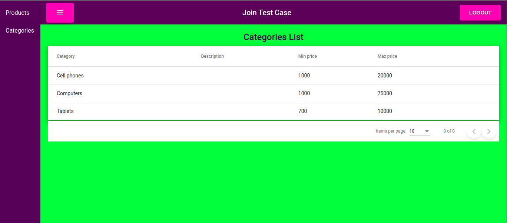

# JOIN TEST CASE FRONTEND
Project built for JOIN in the selection process

## Technologies
Technologies used in this application 

### Project config

- **Node.js**: 
- **npm**: 
- **TypeScript**: 

### Instaled libs

- 
- 
- 
- 
- 
- 
- 
- 
- 
- 

## Instalation and local execute

Install join test case frontend with npm

```bash
  npm install 
  ng build
  ng serve
```

Access via `http://localhost:4200`

## Screenshots

### Login page


### Products List Page


### Categories List Page

